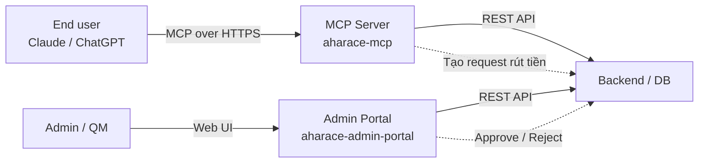

AhaRace Copilot gồm hai service chính có thể clone, chạy local và đóng gói lại cho domain khác. Trang này tổng hợp **link source**, **môi trường live**, **cách bootstrap local**, **cấu hình môi trường** và **các điểm customize** thường gặp.

## Tổng quan hai service

| Service | Vai trò | Live URL | Source code |
| --- | --- | --- | --- |
| **Admin Portal** | UI cho Admin / QM duyệt yêu cầu rút tiền AhaRace | [aharace-admin.up.railway.app](https://aharace-admin.up.railway.app/) | [github.com/hoanghaoha/aharace-admin-portal](https://github.com/hoanghaoha/aharace-admin-portal) |
| **MCP Server** | Endpoint MCP cho Claude / ChatGPT, expose tool gọi API nội bộ | [aharace-mcp-production.up.railway.app](https://aharace-mcp-production.up.railway.app) | [github.com/hoanghaoha/aharace-mcp](https://github.com/hoanghaoha/aharace-mcp) |

<Note>
  Cả hai repo đều deploy trên **Railway**. Khi fork để build use case mới, có thể tái dùng nguyên cấu trúc deploy (Railway / Render / Fly.io) hoặc chuyển sang Docker tự host.
</Note>

## Kiến trúc giữa hai service



- **MCP Server** chỉ chịu trách nhiệm: nhận intent, validate, gọi API backend, trả kết quả cho user.
- **Admin Portal** chỉ chịu trách nhiệm: hiển thị queue, cho Admin / QM thao tác approve / reject / restore.
- Mọi state transition đều đi qua backend → là **single source of truth**.

---

## 1. Admin Portal

Next.js / React app cho cổng quản trị AhaRace.

### 1.1 Yêu cầu môi trường

- Node.js `>= 18.17`
- pnpm `>= 8` (hoặc npm / yarn)
- Tài khoản Railway (nếu deploy theo template gốc)

### 1.2 Clone và chạy local

```bash
git clone https://github.com/hoanghaoha/aharace-admin-portal.git
cd aharace-admin-portal

pnpm install
cp .env.example .env.local
# Mở .env.local và điền các giá trị bên dưới

pnpm dev
```

Mặc định app chạy tại `http://localhost:3000`.

### 1.3 Biến môi trường

<Note>
  Tên biến cụ thể có thể thay đổi theo commit mới nhất — luôn kiểm tra file `.env.example` trong repo. Bảng dưới đây là **nhóm biến** bạn cần cấu hình.
</Note>

| Nhóm | Biến tiêu biểu | Mục đích |
| --- | --- | --- |
| **App** | `NEXT_PUBLIC_APP_URL`, `NODE_ENV` | URL public và môi trường chạy |
| **Backend API** | `API_BASE_URL`, `API_TOKEN` | Endpoint backend AhaRace và token service-to-service |
| **Auth** | `NEXTAUTH_URL`, `NEXTAUTH_SECRET`, `GOOGLE_CLIENT_ID`, `GOOGLE_CLIENT_SECRET` | SSO qua Google Workspace `@ahamove.com` |
| **Database** (nếu portal có DB riêng) | `DATABASE_URL` | Connection string Postgres / MySQL |
| **Logging** | `LOG_LEVEL`, `SENTRY_DSN` | Quan sát lỗi runtime |

<Warning>
  Không commit file `.env.local`. Railway / production dùng **secret manager** của platform, không hardcode token vào source.
</Warning>

### 1.4 Deploy lên Railway

<Steps>
  <Step title="Fork repo">
    Fork `aharace-admin-portal` về tổ chức của bạn.
  </Step>
  <Step title="Tạo project Railway">
    **New Project → Deploy from GitHub** → chọn repo đã fork.
  </Step>
  <Step title="Cấu hình biến môi trường">
    Mở tab **Variables**, thêm toàn bộ key trong `.env.example`.
  </Step>
  <Step title="Build & start command">
    - Build: `pnpm install && pnpm build`
    - Start: `pnpm start`
  </Step>
  <Step title="Gắn custom domain">
    Tab **Settings → Networking → Generate domain** hoặc **Custom domain** để thay `*.up.railway.app`.
  </Step>
</Steps>

### 1.5 Điểm customize thường gặp

| Bạn muốn... | Sửa ở đâu |
| --- | --- |
| Đổi logo / màu thương hiệu | `app/layout.tsx`, `tailwind.config.ts`, thư mục `public/` |
| Thêm cột trong bảng yêu cầu rút tiền | Component bảng trong `app/(admin)/withdrawals/` |
| Thêm trạng thái mới (ví dụ `on_hold`) | Cập nhật enum state ở backend trước, sau đó mở rộng filter \+ badge ở portal |
| Đổi rule phân quyền | Middleware NextAuth \+ bảng `roles` trong backend |
| Thay Google SSO bằng SSO khác | Cấu hình provider mới trong `app/api/auth/[...nextauth]/route.ts` |

---

## 2. MCP Server

Node.js / TypeScript service expose MCP tools cho Claude / ChatGPT.

### 2.1 Yêu cầu môi trường

- Node.js `>= 20`
- pnpm `>= 8`
- Tài khoản Railway (hoặc Docker host)

### 2.2 Clone và chạy local

```bash
git clone https://github.com/hoanghaoha/aharace-mcp.git
cd aharace-mcp

pnpm install
cp .env.example .env
# Điền các biến môi trường bên dưới

pnpm dev
```

Mặc định MCP server lắng nghe tại `http://localhost:8080` (kiểm tra `PORT` trong `.env.example`).

### 2.3 Biến môi trường

| Nhóm | Biến tiêu biểu | Mục đích |
| --- | --- | --- |
| **Server** | `PORT`, `NODE_ENV`, `PUBLIC_URL` | Port, môi trường và URL public của MCP |
| **Auth** | `OAUTH_ISSUER`, `OAUTH_CLIENT_ID`, `OAUTH_CLIENT_SECRET`, `ALLOWED_EMAIL_DOMAIN` | OAuth flow để xác thực user qua `@ahamove.com` |
| **Backend API** | `AHARACE_API_BASE_URL`, `AHARACE_API_TOKEN` | Endpoint backend AhaRace cho các tool gọi vào |
| **Knowledge** | `KB_URL`, `KB_TOKEN` (nếu có) | Knowledge base / vector store dùng cho Q&A |
| **Observability** | `LOG_LEVEL`, `SENTRY_DSN`, `OTEL_EXPORTER_OTLP_ENDPOINT` | Log, error, trace |

### 2.4 Test kết nối với Claude Desktop

Khi server đang chạy local, thêm config sau vào `claude_desktop_config.json`:

```json claude_desktop_config.json
{
  "mcpServers": {
    "aharace-mcp-local": {
      "url": "http://localhost:8080/"
    }
  }
}
```

Restart Claude Desktop, mở chat mới và thử:

```text
Liệt kê các tool của aharace-mcp-local.
```

### 2.5 Thêm tool mới

<Steps>
  <Step title="Định nghĩa tool contract">
    Tạo file mới trong `src/tools/` (ví dụ `get_insight_status.ts`). Khai báo `name`, `description`, `inputSchema`, `outputSchema`.
  </Step>
  <Step title="Implement handler">
    Gọi API backend qua client trong `src/clients/`. Validate input bằng zod / valibot trước khi gọi.
  </Step>
  <Step title="Đăng ký tool">
    Import tool vào registry trung tâm (thường là `src/tools/index.ts`).
  </Step>
  <Step title="Thêm guardrail">
    Kiểm tra `ALLOWED_EMAIL_DOMAIN`, role và confirmation flag (nếu là action ghi).
  </Step>
  <Step title="Viết test">
    Thêm test case trong `tests/tools/` — bao gồm happy path, thiếu permission và thiếu confirmation.
  </Step>
</Steps>

<Tip>
  Theo nguyên tắc trong [Knowledge, workflow & MCP Tools](/developer/knowledge-tools): mỗi tool **nhỏ, một mục đích, có authorization và audit**. Đừng gom `create + approve + reject` vào một tool.
</Tip>

### 2.6 Deploy lên Railway

<Steps>
  <Step title="Fork repo">
    Fork `aharace-mcp` về tổ chức của bạn.
  </Step>
  <Step title="Tạo Railway service">
    **New → Deploy from GitHub** → chọn repo MCP.
  </Step>
  <Step title="Cấu hình biến môi trường">
    Copy toàn bộ key từ `.env.example` vào tab **Variables**. Đặc biệt `PUBLIC_URL` phải khớp với domain Railway / custom domain của bạn.
  </Step>
  <Step title="Build & start">
    - Build: `pnpm install && pnpm build`
    - Start: `pnpm start`
  </Step>
  <Step title="Khai báo trong Claude / ChatGPT">
    Lấy URL Railway sau khi deploy, thêm vào docs [Bắt đầu trong 3 phút](/end-user/quickstart) để end user kết nối được.
  </Step>
</Steps>

---

## 3. Đóng gói dự án mới (template hóa)

Khi build use case khác (Payment, QM, Warehouse, CS…), tái dùng repo này theo trình tự:

<Steps>
  <Step title="Fork cả hai repo">
    Đổi tên theo domain mới, ví dụ `payment-admin-portal`, `payment-mcp`.
  </Step>
  <Step title="Cập nhật brand & copy">
    Logo, tên service, copy UI, email contact, error message — tất cả nằm trong `public/` và file i18n.
  </Step>
  <Step title="Thay tool & schema MCP">
    Xóa các tool AhaRace không dùng. Thêm tool mới theo Skill Pack của domain (xem [Skill Pack playbook](/developer/skill-pack)).
  </Step>
  <Step title="Cập nhật state machine">
    Nếu domain mới có workflow khác (vd. duyệt KPI, duyệt refund), định nghĩa state mới trong backend rồi đồng bộ vào portal.
  </Step>
  <Step title="Cấu hình SSO & domain email">
    Đảm bảo `ALLOWED_EMAIL_DOMAIN` đúng (ahamove.com hoặc subdomain), Google Workspace OAuth client tách riêng cho mỗi project.
  </Step>
  <Step title="Chuẩn bị evaluation set">
    Trước khi UAT, viết test cases theo hướng dẫn ở [Governance & release](/developer/governance).
  </Step>
  <Step title="Release & quan sát">
    Bật dashboard adoption, latency, tool success, handoff. Có rollback plan và contact owner khi incident.
  </Step>
</Steps>

---

## 4. Checklist trước khi go-live

- Repo fork đã đổi `README`, `LICENSE` và contact owner.
- Biến môi trường production đã đặt trong secret manager, không có giá trị dev.
- OAuth domain restriction (`@ahamove.com` hoặc domain tương ứng) đã bật.
- Admin Portal có ít nhất một tài khoản Admin / QM xác minh được.
- MCP Server vượt được smoke test với Claude / ChatGPT thật.
- Có log \+ error tracking (Sentry / OTel) gắn vào.
- Custom domain (nếu dùng) đã verify DNS và HTTPS.
- Tài liệu kết nối cho end user đã cập nhật URL production mới.