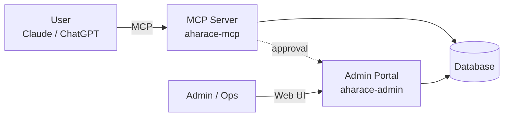

## Tổng quan kiến trúc

Hệ thống AhaRace Copilot gồm 2 thành phần chính cần deploy:



| Thành phần | Repo | URL production |
| --- | --- | --- |
| **Admin Portal** | [hoanghaoha/aharace-admin-portal](https://github.com/hoanghaoha/aharace-admin-portal) | [https://aharace-admin.up.railway.app/](https://aharace-admin.up.railway.app/) |
| **MCP Server** | [hoanghaoha/aharace-mcp](https://github.com/hoanghaoha/aharace-mcp) | [https://aharace-mcp-production.up.railway.app](https://aharace-mcp-production.up.railway.app) |

---

## 1. Admin Portal

### Mục đích

- UI cho Admin / QM / Ops duyệt yêu cầu rút tiền, xử lý state machine.
- Quản lý policy, knowledge base, audit log.
- Cấu hình Skill Pack và quyền truy cập.

### Setup local

```bash
git clone https://github.com/hoanghaoha/aharace-admin-portal.git
cd aharace-admin-portal
npm install
cp .env.example .env
# Điền các biến môi trường
npm run dev
```

### Biến môi trường

| Nhóm | Biến | Mô tả |
| --- | --- | --- |
| **Database** | `DATABASE_URL` | Connection string PostgreSQL |
| **Auth** | `NEXTAUTH_SECRET` | Secret key cho session |
|  | `NEXTAUTH_URL` | URL của Admin Portal |
| **Email domain** | `ALLOWED_EMAIL_DOMAIN` | Mặc định `ahamove.com` |
| **MCP Server** | `MCP_SERVER_URL` | URL của MCP Server |

### Deploy lên Railway

1. Connect repo GitHub vào Railway.
2. Thêm PostgreSQL plugin.
3. Cấu hình env vars ở trên.
4. Auto-deploy khi push `main`.

---

## 2. MCP Server

### Mục đích

- Expose tools (`create_withdraw_request`, `get_withdraw_status`, ...) cho Claude / ChatGPT qua MCP protocol.
- Validate identity, permission, audit log.
- Kết nối Knowledge Base và source systems.

### Setup local

```bash
git clone https://github.com/hoanghaoha/aharace-mcp.git
cd aharace-mcp
npm install
cp .env.example .env
# Điền các biến môi trường
npm run dev
```

### Biến môi trường

| Nhóm | Biến | Mô tả |
| --- | --- | --- |
| **Database** | `DATABASE_URL` | Cùng DB với Admin Portal |
| **Auth** | `JWT_SECRET` | Secret cho MCP auth |
|  | `ALLOWED_EMAIL_DOMAIN` | `ahamove.com` |
| **Admin Portal** | `ADMIN_PORTAL_URL` | URL Admin Portal |
| **OpenAI / Claude** | `OPENAI_API_KEY` | Cho retrieval / embedding |

### Thêm tool mới (5 bước)

1. **Định nghĩa schema** trong `tools/<tool-name>.ts`:
   ```ts
   export const myToolSchema = {
     name: "my_tool",
     description: "...",
     inputSchema: { /* zod */ },
   };
   ```
2. **Implement handler** với validate \+ audit log.
3. **Đăng ký** trong `tools/index.ts`.
4. **Thêm authorization** trong `guardrails.yaml`.
5. **Viết test case** trong `evaluation/`.

---

## 3. Template hóa project mới

Khi build Skill Pack cho domain mới (Payment, QM, Warehouse, CS...), follow 8 bước:

1. **Fork** repo `aharace-mcp` làm template.
2. **Đổi tên** package, env prefix theo domain.
3. **Thay knowledge source** — kết nối policy/SOP của domain.
4. **Định nghĩa intents** trong `intents.yaml`.
5. **Map tools** sang API/DB nội bộ của domain.
6. **Cấu hình guardrails** — quyền, PII, action cấm.
7. **Viết evaluation set** tối thiểu 30 test case.
8. **Deploy** \+ đăng ký connector trong Claude/ChatGPT workspace.

---

## 4. Go-live checklist

- Admin Portal deploy thành công, login bằng `@ahamove.com` hoạt động.
- MCP Server deploy, healthcheck `/health` trả 200.
- Database migration đã chạy, có seed data tối thiểu.
- Connector AhaOps Copilot publish trong Claude/ChatGPT workspace.
- Tool `create_withdraw_request` test end-to-end với user thật.
- Admin Portal có thể duyệt/từ chối request từ MCP.
- State machine chuyển đủ `wait_for_admin → done`.
- Audit log ghi đủ actor, timestamp, request ID.
- Dashboard adoption / tool success / handoff đã online.
- Có rollback plan và owner trực incident.