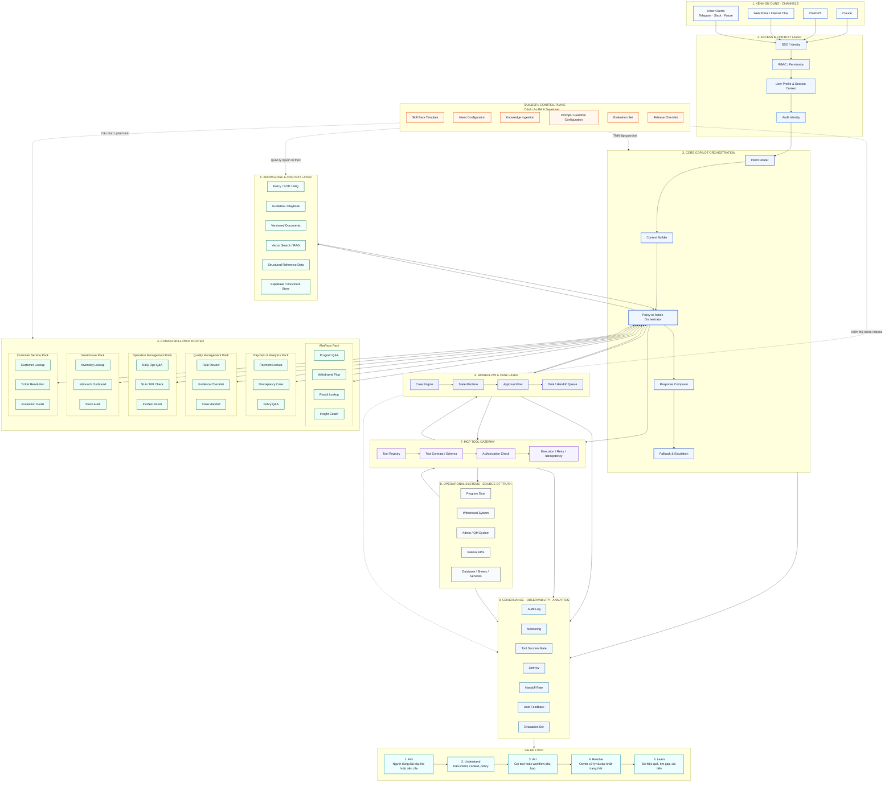
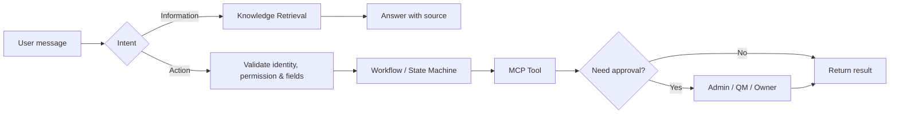

## Sơ đồ kiến trúc tổng thể

Sơ đồ dưới đây mô tả đầy đủ chín lớp của AhaOps Copilot, từ kênh sử dụng đến governance, kèm Builder Plane dành cho BA / Developer và Value Loop đo hiệu quả.

## Chín lớp kiến trúc

| # | Lớp | Mục đích | Thành phần tiêu biểu |
| --- | --- | --- | --- |
| 1 | **Channels** | Nơi người dùng tương tác với Copilot | Claude, ChatGPT, Web Portal, Telegram, Slack |
| 2 | **Access & Context** | Xác thực, phân quyền và xây dựng context phiên | SSO, RBAC, user profile, audit identity |
| 3 | **Core Copilot Orchestration** | Hiểu intent, build context, điều phối policy-to-action | Intent Router, Context Builder, Orchestrator, Response Composer, Fallback |
| 4 | **Domain Skill Pack Router** | Định tuyến vào Skill Pack tương ứng | AhaRace, Payment & Analytics, QM, Operation, Warehouse, CS |
| 5 | **Knowledge & Context** | Lưu policy, SOP, FAQ có version và RAG | Versioned Docs, Vector Search, Supabase / Document Store |
| 6 | **Workflow & Case** | Quản lý trạng thái case, approval, handoff | Case Engine, State Machine, Approval Flow, Task Queue |
| 7 | **MCP Tool Gateway** | Chuẩn hóa gọi tool, kiểm tra quyền và idempotency | Tool Registry, Contract Schema, Authorization, Execution |
| 8 | **Operational Systems** | Source of truth cho dữ liệu nghiệp vụ | Program Data, Withdrawal, Admin/QM, Internal APIs, DB/Sheets |
| 9 | **Governance & Observability** | Đo, audit và đảm bảo chất lượng | Audit Log, Monitoring, Tool Success, Latency, Handoff Rate, Feedback, Eval Set |

## Builder / Control Plane

Lớp dành cho BA và Developer để cấu hình, phát hành và kiểm thử Skill Pack mà không cần đụng vào Core Copilot.

| Thành phần | Trách nhiệm |
| --- | --- |
| **Skill Pack Template** | Khung chuẩn để clone khi tạo pack mới |
| **Intent Configuration** | Định nghĩa intent, ví dụ câu hỏi và routing rule |
| **Knowledge Ingestion** | Nạp policy, SOP, FAQ vào Knowledge Base có version |
| **Prompt / Guardrail Configuration** | Cách phản hồi, điều cấm, PII, authority |
| **Evaluation Set** | Bộ test trước UAT và trước release |
| **Release Checklist** | Cổng kiểm soát trước khi go-live |

## Value Loop

Vòng lặp đo hiệu quả khép kín từ câu hỏi của người dùng đến cải tiến hệ thống.

<Steps>
</Steps>

## Sáu lớp triển khai (rút gọn)

| Lớp | Mục đích | Thành phần tiêu biểu |
| --- | --- | --- |
| **1. Experience** | Nơi user sử dụng Copilot | Claude, ChatGPT, Web Chat, Telegram |
| **2. Identity & Context** | Biết user là ai và được xem / làm gì | SSO, RBAC, session, permission |
| **3. Core Copilot** | Hiểu yêu cầu và điều phối | Intent router, retrieval, handoff |
| **4. Domain Skill Pack** | Cấu hình nghiệp vụ theo phòng ban | AhaRace, Payment, QM, Warehouse, CS |
| **5. Workflow & MCP Tools** | Thực hiện action có kiểm soát | state machine, approval, API, tool registry |
| **6. Source Systems** | Nguồn dữ liệu chính thức | policy, DB, ticketing, internal services |

## Hai luồng cần tách biệt

| Luồng | Dùng khi | Yêu cầu tối thiểu |
| --- | --- | --- |
| **Information** | Hỏi policy, SOP, rubric, hướng dẫn | Source có version và effective date |
| **Action** | Tạo request, tra cứu dữ liệu cá nhân, handoff | Identity, permission, workflow state, audit log |