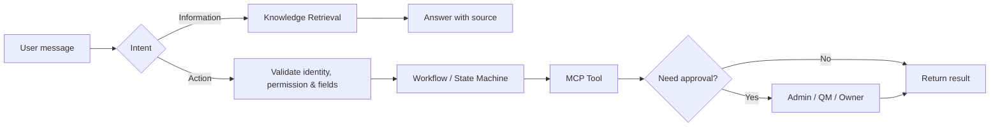

## Sáu lớp triển khai

| Lớp | Mục đích | Thành phần tiêu biểu |
| --- | --- | --- |
| **1. Experience** | Nơi user sử dụng Copilot | Claude, ChatGPT, Web Chat, Telegram |
| **2. Identity & Context** | Biết user là ai và được xem / làm gì | SSO, RBAC, session, permission |
| **3. Core Copilot** | Hiểu yêu cầu và điều phối | Intent router, retrieval, handoff |
| **4. Domain Skill Pack** | Cấu hình nghiệp vụ theo phòng ban | AhaRace, Payment, QM, Warehouse, CS |
| **5. Workflow & MCP Tools** | Thực hiện action có kiểm soát | state machine, approval, API, tool registry |
| **6. Source Systems** | Nguồn dữ liệu chính thức | policy, DB, ticketing, internal services |

## Hai luồng cần tách biệt

| Luồng | Dùng khi | Yêu cầu tối thiểu |
| --- | --- | --- |
| **Information** | Hỏi policy, SOP, rubric, hướng dẫn | Source có version và effective date |
| **Action** | Tạo request, tra cứu dữ liệu cá nhân, handoff | Identity, permission, workflow state, audit log |