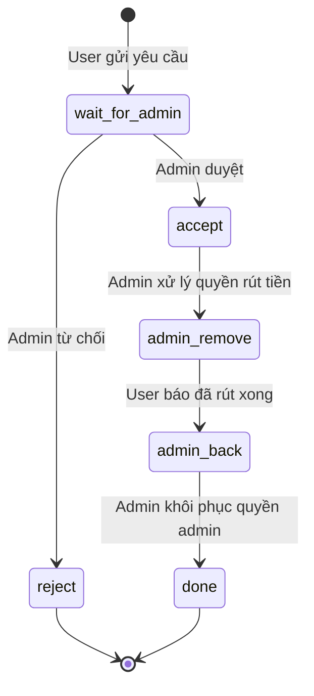

## Quy tắc bắt buộc

1. `accept` không đồng nghĩa với user đã có thể rút tiền; quyền chỉ sẵn sàng khi state chuyển sang `admin_remove`.
2. Chỉ Admin / QM có quyền chuyển `wait_for_admin` sang `accept` hoặc `reject`.
3. Chỉ sau `admin_remove`, user mới được hướng dẫn mở app và rút tiền.
4. `admin_back` là request do user gửi sau khi rút xong; Admin vẫn là owner hoàn tất state `done`.
5. Mọi state transition cần lưu actor, timestamp, request ID và lý do khi reject.