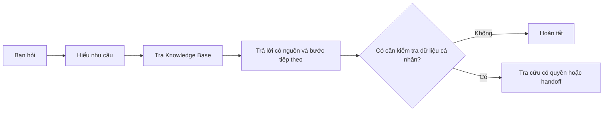

## Bạn có thể hỏi gì

- Điều kiện tham gia, thời gian áp dụng và cách tính điểm.
- Điều kiện nhận giải Tay Đua Siêu Hạng và Insight Vàng.
- Rubric Insight Vàng, cách gửi và cách tra cứu feedback.
- Quy trình công bố kết quả, nhận thưởng và khiếu nại.

## Đặt câu hỏi để nhận câu trả lời hữu ích

| Thay vì hỏi | Hãy hỏi | Vì sao tốt hơn |
| --- | --- | --- |
| “Tôi có được giải không?” | “Điều kiện nhận giải Insight Vàng trong tháng là gì?” | Copilot có thể trả lời chính xác theo policy |
| “Điểm sao vậy?” | “Mỗi điểm giao hợp lệ được tính như thế nào?” | Rõ nội dung cần giải thích |
| “Khiếu nại ở đâu?” | “Tôi cần khiếu nại kết quả AhaRace tháng này. Tôi cần chuẩn bị gì?” | Copilot trả được checklist hành động |

## Copy và dùng ngay

```text
Tóm tắt điều kiện nhận giải Insight Vàng trong tháng này. Hãy dùng bullet ngắn và cho tôi biết tôi cần chuẩn bị evidence gì.
```

```text
Tôi muốn khiếu nại kết quả AhaRace. Hãy hướng dẫn tôi cần chuẩn bị thông tin nào và chuyển tôi đến đúng kênh hỗ trợ.
```

## Copilot phản hồi theo quy tắc nào



<Note>
  Với câu hỏi về policy, Copilot chỉ nên dùng nguồn đang có hiệu lực. Với case cần xác minh theo cá nhân, Copilot sẽ yêu cầu thông tin tối thiểu hoặc hướng dẫn chuyển tiếp tới owner.
</Note>